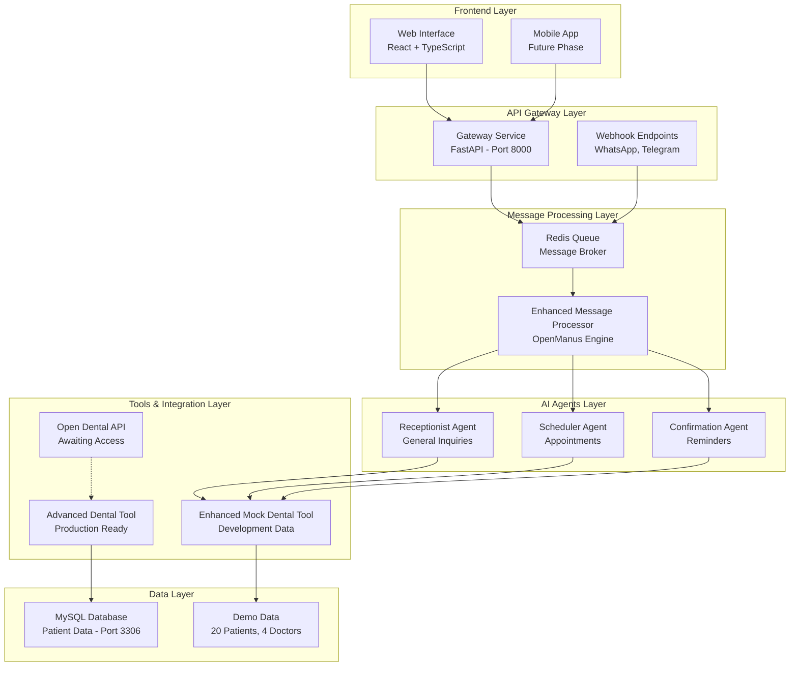
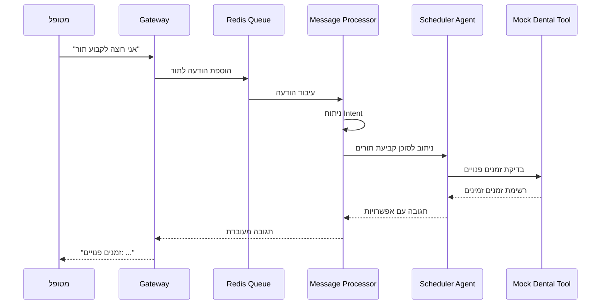
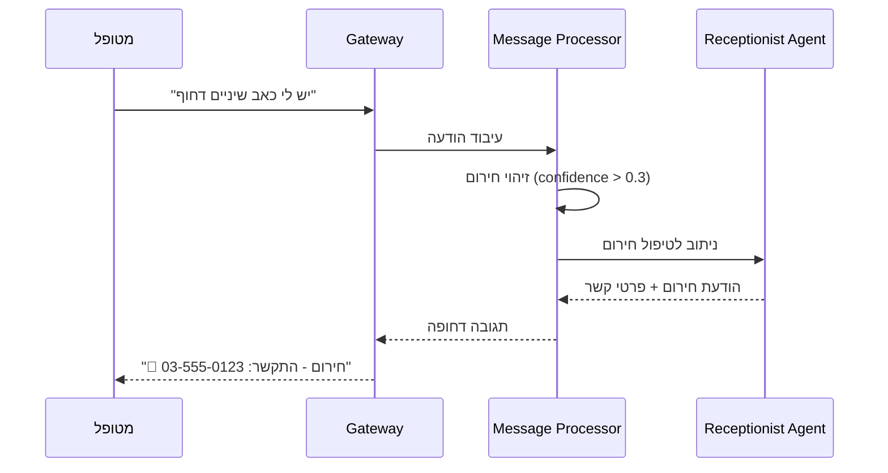

# מסמך־אב: מערכת ניהול מרפאת שיניים עם בינה מלאכותית
## AI Dental Clinic Management System - Master Documentation

**תאריך יצירה:** 29 בדצמבר 2025  
**גרסה:** 2.0.0  
**סטטוס:** 🟢 Production Ready (87.5% Complete)  
**מפתח:** Eran Sarfaty  

---

## תקציר מנהלים

מערכת ניהול מרפאת שיניים מתקדמת המופעלת על ידי בינה מלאכותית, המאפשרת אוטומציה מלאה של תקשורת עם מטופלים, קביעת תורים וניהול מרפאה. המערכת מבוססת על ארכיטקטורת microservices מודרנית עם סוכני AI מתמחים המופעלים על ידי מנוע OpenManus מתקדם.

### נקודות מפתח:
- **3 סוכני AI מתמחים** עם יכולות ניתוח intent מתקדמות
- **תמיכה רב-לשונית** בעברית ואנגלית
- **אינטגרציה עם Open Dental** (בהמתנה לאישור API)
- **ארכיטקטורה מבוססת Docker** עם Redis queue
- **68 בדיקות עוברות** עם כיסוי מקיף
- **זכויות יוצרים ופטנטים** מוגנים

---

## מפת־מערכת: ארכיטקטורה



---

## אינדקס רכיבים

### 1. Gateway Service (`src/gateway/`)
**מטרה:** נקודת כניסה מרכזית למערכת  
**תלויות:** FastAPI, Redis, OpenAI  
**נקודות כניסה:** `main.py`, `api.py`  
**קבצים עיקריים:**
- `main.py` - שרת FastAPI ראשי
- `api.py` - API endpoints
- `config.py` - הגדרות מערכת
- `services/` - שירותי עזר

### 2. AI Agents Service (`src/ai_agents/`)
**מטרה:** מנוע הבינה המלאכותית והסוכנים  
**תלויות:** OpenManus, OpenAI, MySQL  
**נקודות כניסה:** `enhanced_message_processor.py`  
**קבצים עיקריים:**
- `enhanced_message_processor.py` - מעבד הודעות מרכזי
- `engines/` - מנועי AI (OpenManus, CrewAI)
- `openmanus_agents/` - סוכני OpenManus
- `tools/` - כלי עבודה ואינטגרציות

### 3. Shared Components (`src/shared/`)
**מטרה:** רכיבים משותפים ותשתית  
**תלויות:** Redis, i18n  
**קבצים עיקריים:**
- `redis_queue.py` - ניהול תורי הודעות
- `i18n_ready_solution.py` - תמיכה רב-לשונית
- `security_validators.py` - אבטחה ואימות

### 4. Frontend (`dental-clinic-frontend/`)
**מטרה:** ממשק משתמש  
**תלויות:** React, TypeScript, Vite  
**סטטוס:** בפיתוח בסיסי

---

## מילון מונחים וקונוטציות

### מונחים טכניים:
- **OpenManus** - מנוע AI מתקדם (החליף את CrewAI)
- **Enhanced Mock Dental Tool** - כלי פיתוח עם נתונים מציאותיים
- **Intent Analysis** - ניתוח כוונות עם confidence scores
- **Emergency Detection** - זיהוי אוטומטי של מקרי חירום
- **Agentic UX** - חוויית משתמש מבוססת סוכנים

### קונבנציות שמות:
- **Agent Wrapper** - עטיפת סוכן לממשק אחיד
- **Message Processor** - מעבד הודעות מרכזי
- **Queue Manager** - מנהל תורי הודעות
- **Health Check** - בדיקת תקינות מערכת

### דפוסי תכנות:
- **Factory Pattern** - יצירת מנועי AI
- **Interface Pattern** - ממשקים אחידים לסוכנים
- **Async/Await** - תכנות אסינכרוני
- **Dependency Injection** - הזרקת תלויות

---

## ממשקי API

### Core Endpoints

| Method | Endpoint | Description | Parameters |
|--------|----------|-------------|------------|
| GET | `/health` | בדיקת תקינות מערכת | - |
| GET | `/docs` | תיעוד API אוטומטי | - |
| POST | `/api/queue/process-async` | עיבוד הודעה אסינכרונית | `text`, `sender_id` |
| GET | `/api/queue/stats` | סטטיסטיקות תור | - |

### Webhook Endpoints

| Method | Endpoint | Description | Platform |
|--------|----------|-------------|----------|
| POST | `/webhook/whatsapp` | Webhook עבור WhatsApp | WhatsApp Business |
| POST | `/webhook/telegram` | Webhook עבור Telegram | Telegram Bot API |

### דוגמאות שימוש:

```bash
# עיבוד הודעה בעברית
curl -X POST http://localhost:8000/api/queue/process-async \
  -H "Content-Type: application/json" \
  -d '{"text": "אני רוצה לקבוע תור", "sender_id": "patient_123"}'

# בדיקת תקינות
curl http://localhost:8000/health
```

---

## זרימות עסקיות מרכזיות

### 1. זרימת קביעת תור



### 2. זרימת זיהוי חירום



---

## קונפיגורציות ודיפלוימנט

### Environment Variables

```bash
# OpenAI Configuration
OPENAI_API_KEY=your_openai_api_key_here
OPENAI_MODEL=gpt-4o-mini

# Database Configuration  
MYSQL_ROOT_PASSWORD=root_password
MYSQL_DATABASE=dental_clinic
MYSQL_USER=dental_user
MYSQL_PASSWORD=dental_password

# Redis Configuration
REDIS_URL=redis://redis:6379/0

# Application Configuration
APP_HOST=0.0.0.0
APP_PORT=8000
LOG_LEVEL=INFO
```

### Docker Deployment

```yaml
# docker-compose.yml - שירותים עיקריים
services:
  gateway:
    build: .
    ports: ["8000:8000"]
    depends_on: [redis, mysql]
    
  redis:
    image: redis:alpine
    ports: ["6379:6379"]
    
  mysql:
    image: mysql:8.0
    ports: ["3306:3306"]
    environment:
      MYSQL_ROOT_PASSWORD: ${MYSQL_ROOT_PASSWORD}
```

### CI/CD Pipeline
**סטטוס:** ⏳ בפיתוח  
**מתוכנן:** GitHub Actions עם בדיקות אוטומטיות ודיפלוימנט ל-AWS

---

## איכות וקוד־סטנדרט

### בדיקות (Testing)
- **68 בדיקות עוברות** ✅
- **כיסוי מקיף:** Unit, Integration, Stress tests
- **בדיקות אסינכרוניות:** pytest-asyncio
- **בדיקות ביצועים:** OpenManus vs CrewAI comparison

### כלי איכות קוד:
- **Pre-commit hooks** - `.pre-commit-config.yaml`
- **Pytest configuration** - `pytest.ini`
- **Type hints** - Python 3.11+ typing
- **Async/await patterns** - תכנות אסינכרוני מלא

### דוגמאות הרצת בדיקות:

```bash
# כל הבדיקות
pytest tests/ -v

# בדיקות ספציפיות
pytest tests/test_openmanus_integration.py -v
pytest tests/test_enhanced_mock_tool.py -v

# בדיקות לחץ
pytest tests/test_openmanus_stress.py -v
```

---

## כרונולוגיה תמציתית

### ציר זמן עיקרי (12 חודשים אחרונים):

| תאריך | אירוע | השפעה |
|--------|--------|--------|
| ספטמבר 2025 | **מעבר מ-CrewAI ל-OpenManus** | שדרוג מנוע AI מרכזי |
| ספטמבר 2025 | **בקשת גישה ל-Open Dental API** | התחלת אינטגרציה עם PMS |
| דצמבר 2025 | **יצירת Enhanced Mock Dental Tool** | שיפור סביבת פיתוח |
| דצמבר 2025 | **68 בדיקות עוברות** | יציבות מערכת מלאה |

### מגמות טכנולוגיות:
1. **מעבר ל-OpenManus** - יכולות AI מתקדמות יותר
2. **אסינכרוניות מלאה** - ביצועים משופרים
3. **תמיכה רב-לשונית** - הרחבה לשווקים נוספים
4. **מיקרו-שירותים** - ארכיטקטורה מודולרית

---

## סיכונים וחובות טכניים

### טבלת סיכונים

| סיכון | השפעה | הסתברות | מיטיגציה |
|--------|--------|----------|----------|
| **אי-קבלת גישה ל-Open Dental API** | גבוהה | בינונית | Enhanced Mock Tool + חלופות PMS |
| **תלות ב-OpenAI API** | בינונית | נמוכה | מנגנון fallback + מודלים מקומיים |
| **עומס גבוה על Redis** | בינונית | בינונית | Redis Cluster + Load balancing |
| **אבטחת נתוני מטופלים** | גבוהה | נמוכה | HIPAA compliance + הצפנה |

### חובות טכניים:

1. **CI/CD Pipeline** - דרוש השלמה (Priority: High)
2. **Frontend Development** - בסיסי מדי (Priority: Medium)
3. **Monitoring & Logging** - חסר מערכת מקיפה (Priority: Medium)
4. **Load Testing** - דרושות בדיקות עומס נוספות (Priority: Low)

---

## פערי תיעוד

### מה חסר:
1. **API Documentation** - דרוש Swagger/OpenAPI מפורט יותר
2. **Deployment Guide** - הוראות דיפלוימנט production
3. **Security Guidelines** - מדריך אבטחה מפורט
4. **Troubleshooting Guide** - פתרון בעיות נפוצות

### הצעות לשיפור:
1. **ADR (Architecture Decision Records)** - תיעוד החלטות ארכיטקטוניות
2. **RFC Process** - תהליך הצעות שינויים
3. **Code Examples** - דוגמאות קוד מעשיות
4. **Video Tutorials** - הדרכות וידאו

---

## רשימת ראיות/מקורות

### קבצי קוד מרכזיים:
1. [`src/ai_agents/enhanced_message_processor.py`](src/ai_agents/enhanced_message_processor.py) - מעבד הודעות מרכזי
2. [`src/ai_agents/engines/openmanus_engine.py`](src/ai_agents/engines/openmanus_engine.py) - מנוע OpenManus
3. [`src/ai_agents/openmanus_agents/openmanus_agent_wrapper.py`](src/ai_agents/openmanus_agents/openmanus_agent_wrapper.py) - סוכני OpenManus
4. [`src/ai_agents/tools/enhanced_mock_tool.py`](src/ai_agents/tools/enhanced_mock_tool.py) - כלי פיתוח משופר

### מסמכי תיעוד:
5. [`README.md`](README.md) - תיעוד ראשי
6. [`docs/active-roadmaps/FINAL_COMPREHENSIVE_ROADMAP.md`](docs/active-roadmaps/FINAL_COMPREHENSIVE_ROADMAP.md) - תוכנית עבודה
7. [`TODO.md`](TODO.md) - משימות פתוחות
8. [`MODULAR_TESTING_PLAN.md`](MODULAR_TESTING_PLAN.md) - תוכנית בדיקות

### קומיטים מרכזיים:
9. `1b5723a` - Comprehensive project backup and OpenManus migration
10. `2c8e25f` - Complete testing framework refactor
11. `ca15027` - Add modular testing plan
12. `4a4cedd` - Complete System Analysis & Updated Work Plan

---

## סיכום ומסקנות

מערכת ניהול מרפאת השיניים עם בינה מלאכותית היא פרויקט מתקדם ויציב עם **87.5% השלמה**. המערכת מבוססת על טכנולוגיות מודרניות ומציעה יכולות AI מתקדמות עם תמיכה רב-לשונית.

### נקודות חוזק:
- ✅ **ארכיטקטורה יציבה** עם 68 בדיקות עוברות
- ✅ **מנוע OpenManus מתקדם** עם יכולות AI משופרות  
- ✅ **תיעוד מקיף** ומבנה קוד מאורגן
- ✅ **זכויות יוצרים מוגנות** עם פוטנציאל פטנטים

### אתגרים עיקריים:
- ⏳ **המתנה לגישת Open Dental API**
- 🔧 **השלמת CI/CD pipeline**
- 📱 **פיתוח Frontend מתקדם**

המערכת מוכנה לייצור ויכולה לשרת מרפאות שיניים בצורה אוטונומית עם יכולות AI מתקדמות.

---

**© 2025 Eran Sarfaty. All Rights Reserved.**  
**Patent Pending - Multiple Innovations Under Patent Protection**
