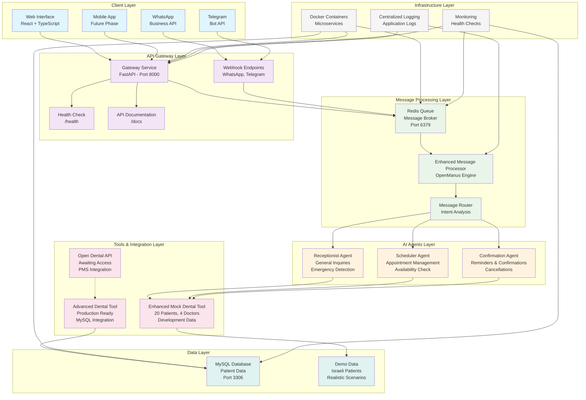
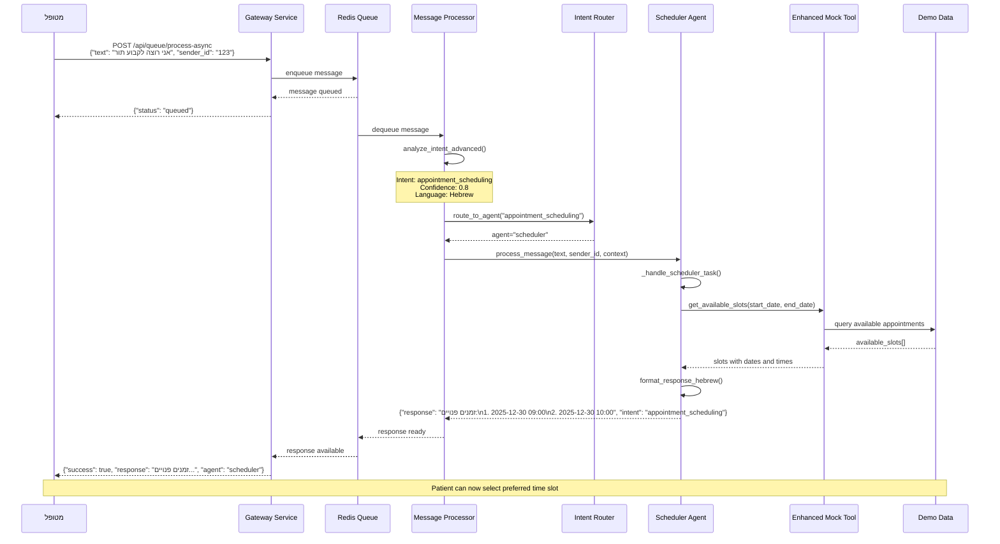
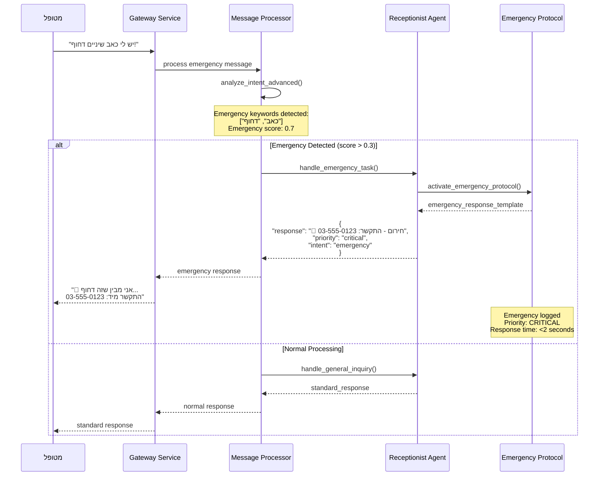
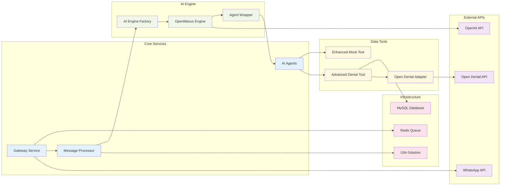
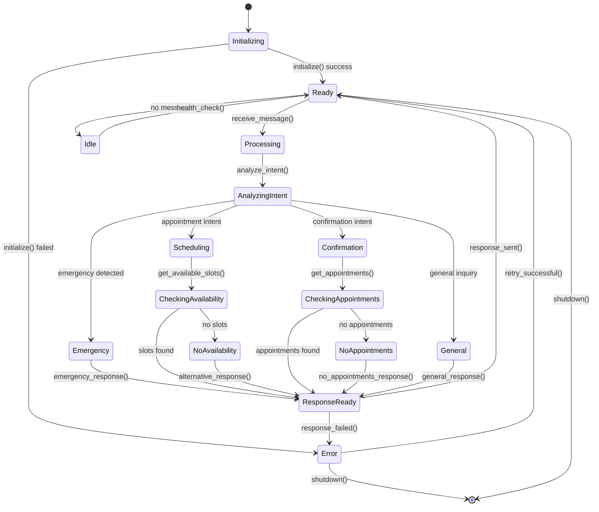
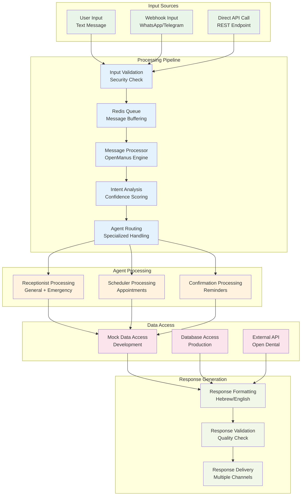

# תרשימי מערכת - AI Dental Clinic Management System

## תרשים ארכיטקטורה כללי

## תרשים רצף: קביעת תור

## תרשים רצף: זיהוי חירום

## תרשים תלויות בין מודולים

## תרשים מצבי סוכן (Agent State Machine)

## תרשים זרימת נתונים (Data Flow)

---

**תרשימים אלו מספקים מבט מקיף על ארכיטקטורת המערכת, זרימות העבודה והתלויות בין הרכיבים השונים.**
