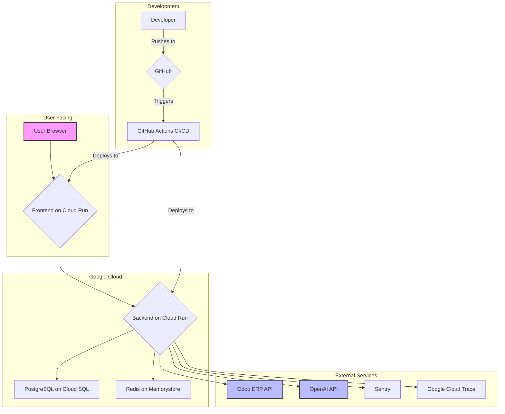

# DentaFlow System Architecture

**Status:** ✅ Current | **Last Updated:** November 21, 2025

This document provides a high-level overview of the DentaFlow system architecture, designed for AI development agents.

---

## 1. Core Principles

- **Service-Oriented Architecture (SOA):** Decoupled frontend and backend services.
- **AI-First Design:** Core logic is handled by a multi-agent AI system.
- **Scalability:** Built on serverless, containerized infrastructure (Google Cloud Run).
- **Single Source of Truth:** Odoo ERP is the master record for all clinical and patient data.
- **Security by Design:** HIPAA/GDPR compliance is a core architectural consideration.

---

## 2. Component Overview

| Component | Technology | Location | Purpose |
|---|---|---|---|
| **Frontend** | React 18, Vite, Tailwind | `/frontend` | Clinic & patient web portals |
| **Backend** | FastAPI, Python 3.11 | `/backend` | Main API, business logic, AI agents |
| **AI Agents** | LangChain, LangGraph | `/backend/app/agents` | Core AI agent system |
| **Database** | PostgreSQL (Cloud SQL) | Google Cloud | Primary data store for non-Odoo data |
| **Cache** | Redis | Google Cloud | Session & cache management |
| **ERP** | Odoo 17 | External | Clinic management system |
| **Infrastructure** | Google Cloud Run, Docker | Google Cloud | Serverless container hosting |
| **CI/CD** | GitHub Actions | `/.github/workflows` | Automated build, test, deploy |

---

## 3. System Interaction Diagram

This diagram illustrates the primary data and interaction flows between components.

---

## 4. Backend Architecture

**For a detailed breakdown, see `docs/architecture/BACKEND.md`.**

- **Framework:** FastAPI for high-performance, async API endpoints.
- **Structure:** Modular design organized by features (e.g., `agents`, `api`, `services`, `models`).
- **Authentication:** JWT-based with organization context, handled by `app/auth`.
- **Database Interaction:** SQLAlchemy ORM for PostgreSQL, with Alembic for migrations.
- **AI Core:** LangGraph orchestrates the flow between 6 specialized AI agents.
- **Odoo Integration:** A dedicated service layer (`app/services/odoo`) manages all communication with the Odoo ERP.

### AI Agent System

- **Supervisor Agent:** The central orchestrator. It receives user requests, determines the user's intent, and routes the task to the appropriate specialist agent.
- **Specialist Agents:**
  - **Alex (Patient Care):** Handles appointments, patient queries.
  - **Sarah (Clinical):** Manages clinical records, treatment plans.
  - **Marcus (Financial):** Manages billing, invoices, financial analytics.
  - **Sophia (Admin):** Handles HR, team coordination, internal tasks.
  - **Harper (Compliance):** Ensures all operations are HIPAA compliant, logs events for audit.
- **Tool Library:** Agents have access to 30+ specialized tools (e.g., `get_patient_appointments`, `create_invoice`, `check_hipaa_compliance`).

---

## 5. Frontend Architecture

**For a detailed breakdown, see `docs/architecture/FRONTEND.md`.**

- **Framework:** React 18 with Vite for fast development and bundling.
- **Styling:** Tailwind CSS for a utility-first styling approach.
- **State Management:** React Context API for global state (e.g., AuthContext, DemoContext).
- **Routing:** React Router for client-side routing.
- **Component Library:** Shadcn/ui for accessible and reusable UI components.
- **Structure:** Organized by features (`pages`, `components`, `layouts`, `contexts`, `services`).

---

## 6. Data Model

**For a detailed breakdown, see `docs/architecture/DATABASE.md`.**

- **Odoo (Primary):** The source of truth for Patients, Appointments, Invoices, etc.
- **PostgreSQL (Secondary):** Stores data not native to Odoo, such as:
  - `users`: Application users and their roles.
  - `organizations`: Tenant clinics.
  - `conversations`: AI agent conversation history (PostgresSaver).
  - `audit_logs`: HIPAA compliance logs generated by Harper.
  - `demo_leads`: Data for the interactive demo.

---

## 7. Related Documents

- **[DEVELOPMENT.md](DEVELOPMENT.md):** How to set up and run the project locally.
- **[API_REFERENCE.md](API_REFERENCE.md):** Detailed API endpoint documentation.
- **[DEPLOYMENT.md](DEPLOYMENT.md):** Deployment processes for staging and production.
