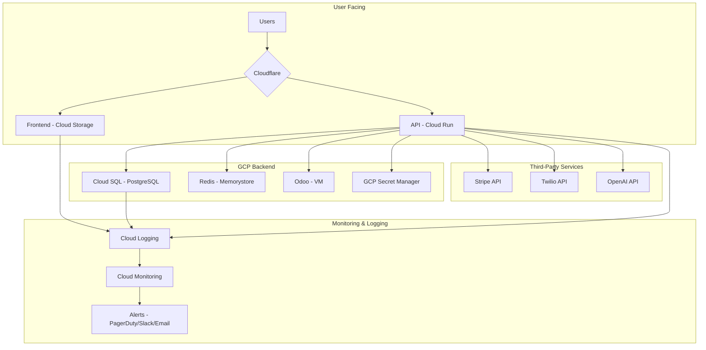

# DentaFlow SaaS - Production Runbook

**Author:** Manus AI  
**Date:** October 16, 2025  
**Version:** 1.0  
**Classification:** Internal Use Only

---

## 1. Overview

This runbook provides operational procedures for deploying, managing, and troubleshooting the DentaFlow SaaS platform in production. It is intended for the on-call engineering team and SREs.

**Primary Goal:** Ensure the reliability, availability, and security of the DentaFlow platform.

**Contact:**
- **On-Call Engineer:** See PagerDuty schedule
- **Security Issues:** security@dentaflow.ai
- **Slack Channel:** #dentaflow-ops

## 2. System Architecture

**High-Level Diagram:**



**Components:**

| Component | Technology | Description |
|---|---|---|
| **Frontend** | React, Material-UI | Static site hosted on Cloud Storage, served via Cloud CDN |
| **Backend API** | FastAPI, Python 3.11 | Main application logic, deployed on Cloud Run |
| **Database** | PostgreSQL 15 | Primary data store, hosted on Cloud SQL |
| **Cache** | Redis | Caching for sessions, queries, and rate limiting, on Memorystore |
| **ERP** | Odoo 17 | Appointment and patient management, on a dedicated VM |
| **Secrets** | GCP Secret Manager | Secure storage for API keys and credentials |
| **Monitoring** | Cloud Monitoring | Dashboards, alerting, and metrics |
| **Logging** | Cloud Logging | Centralized logging for all services |
| **CI/CD** | GitHub Actions | Automated testing and deployment |

## 3. Deployment

### 3.1. CI/CD Pipeline

Deployments are automated via GitHub Actions. Merging to the `main` branch triggers the production deployment workflow.

**Workflow:** `.github/workflows/deploy-prod.yml`

**Steps:**
1.  **Test:** Run unit, integration, and security tests.
2.  **Build:** Build Docker images for backend and frontend.
3.  **Push:** Push images to Google Artifact Registry.
4.  **Deploy Backend:** Deploy new revision to Cloud Run.
5.  **Deploy Frontend:** Sync new build to Cloud Storage bucket.
6.  **Run Migrations:** Run Alembic database migrations.
7.  **Notify:** Send deployment status to Slack.

### 3.2. Manual Deployment

Manual deployments should only be performed in emergencies.

```bash
# Authenticate with GCP
gcloud auth login
gcloud config set project dentaflow-saas

# Deploy Backend
cd backend
gcloud run deploy dentaflow-backend --image gcr.io/dentaflow-saas/backend:latest --region us-central1

# Deploy Frontend
cd frontend
npm run build
gsutil -m rsync -r build/ gs://dentaflow-frontend
```

### 3.3. Rollback Procedures

**Cloud Run (Backend):**
1.  Go to the Cloud Run service in the GCP Console.
2.  Select the `dentaflow-backend` service.
3.  Click "Deploy New Revision".
4.  Select a previous, stable container image.
5.  Set traffic to 100% for the new revision.

**Cloud Storage (Frontend):**
1.  Frontend builds are versioned in the bucket (e.g., `build-20251016-1`).
2.  To roll back, simply copy the contents of a previous versioned folder to the root.

```bash
# Example: Roll back to a previous build
gsutil -m rsync -r gs://dentaflow-frontend/build-20251015-1/ gs://dentaflow-frontend/
```

## 4. Monitoring & Alerting

### 4.1. Dashboards

- **Production Overview:** [Link to GCP Dashboard]
- **Business Metrics:** [Link to Super Admin Dashboard]
- **Logs:** [Link to Cloud Logging]

### 4.2. Key Metrics to Watch

| Metric | Threshold | Why it matters |
|---|---|---|
| **API Error Rate (5xx)** | > 1% | Indicates backend problems |
| **API Latency (p95)** | > 1s | Poor user experience |
| **CPU Utilization** | > 80% | Risk of performance degradation |
| **Database Connections** | > 80% of max | Risk of connection exhaustion |
| **Uptime Check** | Failing | Service is down |

### 4.3. Alerting & Escalation

| Severity | Alert Channel | Escalation |
|---|---|---|
| **SEV-1 (Critical)** | PagerDuty | On-call engineer paged immediately |
| **SEV-2 (High)** | Slack (#dentaflow-ops) | On-call engineer to acknowledge within 15 mins |
| **SEV-3 (Low)** | Email | Acknowledge within 24 hours |

**SEV-1 Examples:**
- API is down (uptime check fails for >5 mins)
- Database is down
- 5xx error rate > 10%
- Security breach

## 5. Incident Response

**Goal:** Restore service as quickly as possible, then investigate the root cause.

**Steps:**
1.  **Acknowledge:** Acknowledge the alert in PagerDuty/Slack.
2.  **Triage:** Assess the impact. Is it affecting all users or a subset? Is it a full outage or a degradation?
3.  **Communicate:** Post a status update in the #dentaflow-ops Slack channel. Create a new channel for the incident (e.g., #incident-20251016-db-outage).
4.  **Investigate:** Check dashboards and logs to identify the cause.
5.  **Mitigate:** Apply a fix. This could be a rollback, scaling up resources, or a hotfix.
6.  **Resolve:** Once the service is stable, mark the incident as resolved.
7.  **Postmortem:** Conduct a blameless postmortem within 48 hours.

### 5.1. Common Issues & Resolutions

| Issue | First Steps | Resolution |
|---|---|---|
| **High API Error Rate** | Check Cloud Run logs for exceptions. | Roll back the last deployment. Investigate the code change. |
| **High API Latency** | Check database query times in Cloud SQL Insights. Check for high CPU/memory on Cloud Run. | Optimize slow queries. Scale up Cloud Run instances. |
| **Database Down** | Check Cloud SQL status page. | Failover to the read replica. Restore from backup if necessary. |
| **Stripe Webhook Failures** | Check Stripe dashboard for webhook logs. | Check API logs for errors. Resend failed webhooks from Stripe. |

## 6. Maintenance

### 6.1. Database

- **Backups:** Automated daily, retained for 7 days.
- **Restoration Test:** Performed quarterly. See `docs/operations/DB_RESTORE_PROCEDURE.md`.
- **Maintenance Window:** Sunday 2:00 AM - 6:00 AM UTC for Cloud SQL updates.

### 6.2. Dependency Updates

- **Process:** Dependabot creates PRs for outdated dependencies.
- **Schedule:** Review and merge security updates weekly. Review and merge other updates monthly.

### 6.3. Security Patching

- **OS:** GCP manages OS patching for Cloud Run and Cloud SQL.
- **Container Images:** Base images are updated and rebuilt weekly.

## 7. Security

- **Security Incidents:** Follow the Incident Response plan. Page the on-call security engineer.
- **Vulnerability Reports:** Email security@dentaflow.ai. Acknowledge within 24 hours.
- **Penetration Testing:** Conducted annually by a third party.

## 8. Appendix

- **Architecture Decision Records (ADRs):** `docs/architecture/`
- **HIPAA Compliance Docs:** `docs/compliance/`
- **Security Checklist:** `docs/security/SECURITY_HARDENING_CHECKLIST.md`
- **Terraform Config:** `infrastructure/terraform/`
- **GCP Project ID:** `dentaflow-saas`
- **Primary Region:** `us-central1`

